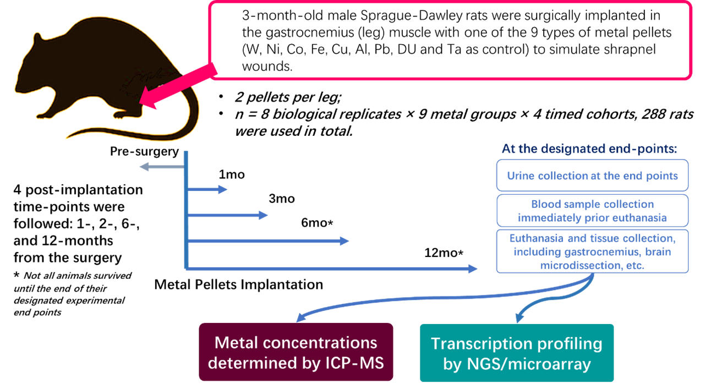

# A Curated Dataset of Biological Study for Rodent Shrapnel Model with Pure Metals Implantation
_by Chen Tianhao_ and _Prof. Xiaohua Douglas Zhang_

## Summary
Injuries with embedded metal fragments are the unfortunate consequence of modern armed conflicts, and many defense personnel survive with the embedded fragments in their bodies. In response to concerns about embedded metal fragments, the Armed Forces Radiobiology Research Institute in Bethesda, MD has utilized a rodent model, integrating biokinetics, toxicology and bioinformatics approaches, to comprehensively investigate the health effects of eight types of military-relevant pure metals implantation on rats. As a part of a greater collaboration project, here we present a complemental manuscript which comprehensively describes the curated dataset, provides any technical details and highlights the validation procedures, to help other reuse the data. In addition, we developed a searchable database with web interface where researchers could search and download data directly.

### (A)

### (B)

Overview of my work, (A) a schematic of the study design, and (B) a schematic of the database with a webapp interface.
